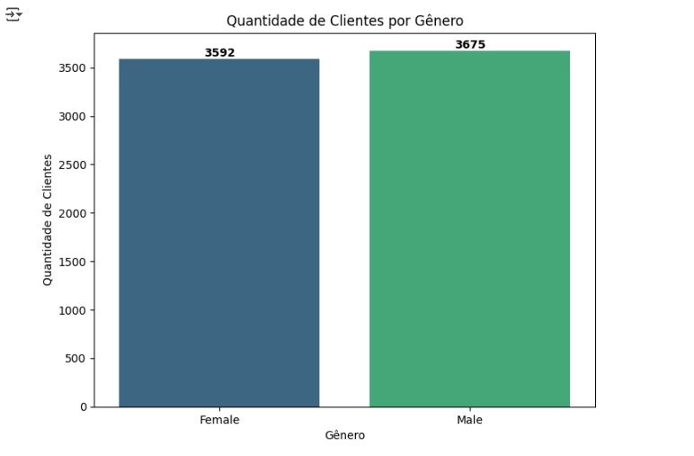
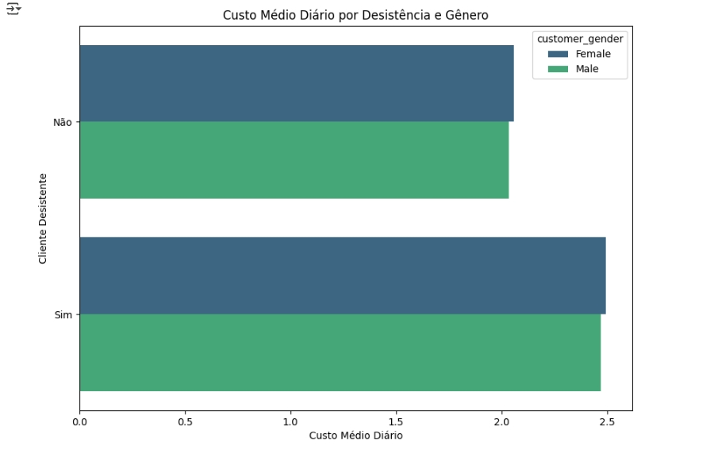
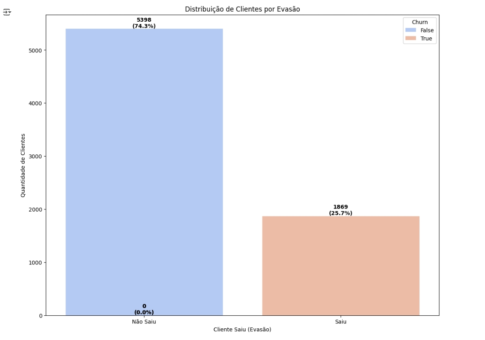

# 2025-06-03-G8-Oracle-Alura-Challenge2
## 2nd Project in G8-Oracle-Alura

Segundo projeto do G8-Oracle-Alura
Análise de dados de clientes de uma empresa de telecomunicações.

## desafio2alura8oracle.ipynb 
###### 
- notebook Jupyter contendo células interativas de código e texto para usar no Google Colab e fazer a análise de dados.

    
   @@@ Doações: Pix: altaperformancenubank@gmail.com 

<h2> 🤖 Tecnologias utilizadas</h2>

  
  

<h2> 📊 Análise de dados - Estrutura do repositório</h2>

### Arquivos nesse repositório

##### desafio2alura8oracle.ipynb - 
- notebook Jupyter Jupyter contendo células interativas de código e texto para usar no Google Colab e fazer a análise de dados.

##### TelecomX_Data_normalizado.csv - 
- Arquivo com os dados normalizados, em formato csv, exportado pelo arquivo notebook.

##### TelecomX_Data.json - 
- Arquivo com os dados brutos, em formato json, foi feito download do site do desafio.

##### filtro_clientes_para_contactar.csv - 
- Arquivo com os dados filtrados, clientes femininos que devem ser contactados, em formato csv, exportado pelo arquivo notebook.

##### filtro_clentes_para_contactar_homens.csv - 
- Arquivo com os dados filtrados, clientes masculinos que devem ser contactados, em formato csv, exportado pelo arquivo notebook.  

##### modelos - 
- pasta com os modelos fornecidos pelo desafio.

##### journaling - 
- pasta com o modelo gráfico do TelecomX_Data.json - gerado no DeepSeek R1, Manus Ai e o site https://www.jsoncrack.com, mostra também o link para o site https://tools-4all.com/github-downloader usado para baixar o arquivo json.

##### images - 
- pasta com as imagens do desafio.

##### notebook - 
- pasta com o notebook Jupyter contendo células interativas de código e texto para usar no Google Colab e fazer a análise de dados, arquivos .csv exportados e o arquivo .json bruto.

<h2> 📊 Análise de dados - Gráficos </h2>

### Quantidade de clientes por gênero

### Custo médio diário por Desistência e Gênero

### Distribuição de clientes por Evasão

### Correlação entre Metodo de Pagamento e Evasão de Clientes

### 