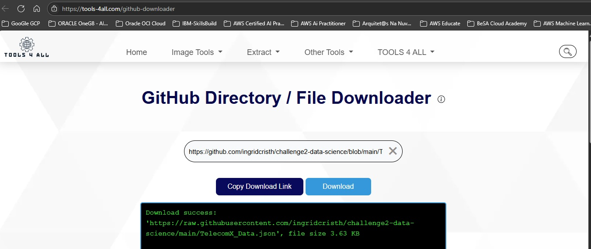
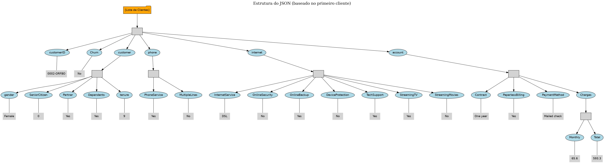
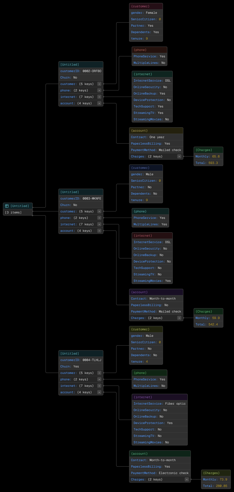

# I
#### Download the json file

###### using the link: https://tools-4all.com/github-downloader

i can get the json file on the link: https://github.com/ingridcristh/challenge2-data-science/blob/main/TelecomX_Data.json



# II
#### Graphical tree image of json file, manus.Ai

###### with this prompt : I want a image, graphical tree of this json file, like the site jsoncrack.com prduce. I need a detailed image to use in a presentation.

###### prompt was used in manus.ia https://manus.im


###### a imagem representa a estrutura detalhada dos dados, baseada no primeiro registro do arquivo

# III
#### Graphical tree image of json file, deepseek R1 Ai

###### with this prompt : I want a graphical image to use in a presentation.
###### Show me a graphical tree of the structure of this json file, like the site jsoncrack.com can do.

```text
JSON STRUCTURE TREE: TelecomX Customer Data
┌──────────────────────────────────────────────────┐
│ Root: Array (704 customer records)               │
└─┬────────────────────────────────────────────────┘ 
  │  ├── Customer Object (each record)
  │   │
  │   ├── customerID: String [Unique Identifier]
  │   │   └── Format: "XXXX-XXXXX"
  │   │
  │   ├── Churn: String [Target Variable]
  │   │   └── Values: "Yes", "No", "" (missing)
  │   │
  │   ├── customer: Object [Demographics]
  │   │   ├── gender: String ──▶ {"Male", "Female"}
  │   │   ├── SeniorCitizen: Integer ──▶ {0, 1}
  │   │   ├── Partner: String ──▶ {"Yes", "No"}
  │   │   ├── Dependents: String ──▶ {"Yes", "No"}
  │   │   └── tenure: Integer [Months with company]
  │   │       └── Range: 1-72 months
  │   │
  │   ├── phone: Object [Phone Services]
  │   │   ├── PhoneService: String ──▶ {"Yes", "No"}
  │   │   └── MultipleLines: String ──▶ 
  │   │       └── Values: {"Yes", "No", "No phone service"}
  │   │
  │   ├── internet: Object [Internet Services]
  │   │   ├── InternetService: String ──▶ 
  │   │   │   └── {"DSL", "Fiber optic", "No"}
  │   │   ├── OnlineSecurity: String ──▶ 
  │   │   │   └── {"Yes", "No", "No internet service"}
  │   │   ├── OnlineBackup: String ──▶ 
  │   │   │   └── {"Yes", "No", "No internet service"}
  │   │   ├── DeviceProtection: String ──▶ 
  │   │   │   └── {"Yes", "No", "No internet service"}
  │   │   ├── TechSupport: String ──▶ 
  │   │   │   └── {"Yes", "No", "No internet service"}
  │   │   ├── StreamingTV: String ──▶ 
  │   │   │   └── {"Yes", "No", "No internet service"}
  │   │   └── StreamingMovies: String ──▶ 
  │   │       └── {"Yes", "No", "No internet service"}
  │   │
  │   └── account: Object [Billing Information]
  │       ├── Contract: String ──▶ 
  │       │   └── {"Month-to-month", "One year", "Two year"}
  │       ├── PaperlessBilling: String ──▶ {"Yes", "No"}
  │       ├── PaymentMethod: String ──▶ 
  │       │   └── {
  │       │        "Electronic check",
  │       │        "Mailed check",
  │       │        "Bank transfer (automatic)",
  │       │        "Credit card (automatic)"
  │       │       }
  │       └── Charges: Object
  │           ├── Monthly: Float [Recurring charge]
  │           │   └── Range: $18.25-$118.75
  │           └── Total: String [Lifetime value]
  │               └── Note: Numeric string ($X.XX format)
  │
  └── ... (repeated for 704 customers)
  ```

# IV
#### Graphical tree image of json file, https://jsonCrack.com, first 3 records

###### i have to break the original .json file in the first 3 records.




